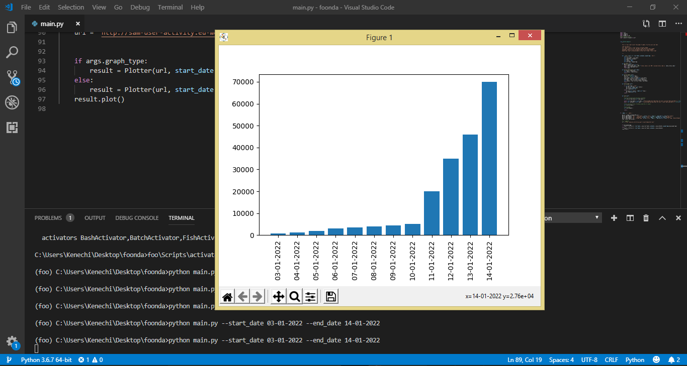
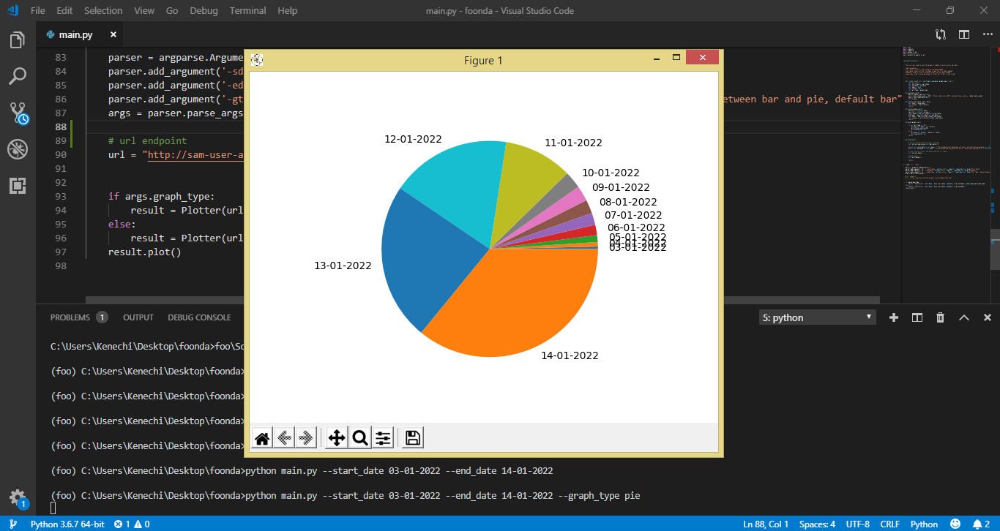
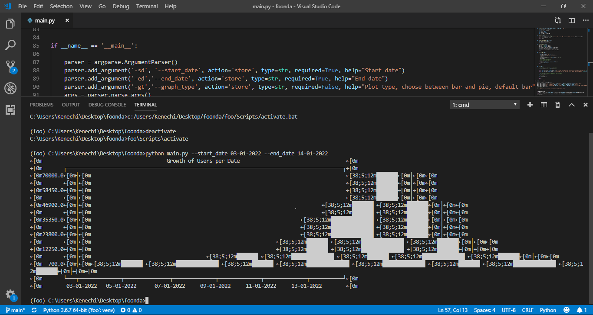

# foondamate_task

This is the solution code to the data engineering [task](https://careers.foondamate.com/data-engineer-remote/foondamate-software-engineer-coding-challenge-001).

### Repo Structure:

1) main.py : This is the python file that plots the required graph.
2) images : Contain images of the graph output of the working code.

### How to run the script:
1) clone git repo to your local computer
2) use your command prompt or desired terminal (make sure to be in the same directory as the main.py and requirements.txt)
3) create a virtual enviroment, using the command below (note: foo is the name of the virtual enviroment): 
  - virtualenv foo
4) activate the virtualenv using the following:
  - foo\Scripts\activate
5) run the following to install the necessary packages: 
  - pip install -r requirements.txt 
5) use the following to plot graph:
  - python main.py --start_date 03-01-2022 --end_date 14-01-2022
6) to plot graph as pie chart (optional):
  - python main.py --start_date 03-01-2022 --end_date 14-01-2022 --graph_type pie

### Bar chart view

### Pie chart view

### Minor Challenge
Libraries like plotext that could be used to plot graphs in the CLI interface failed to work effectively on my system. Hence, creating a small window displaying the graph was next option available. Below is the visualization provided when attempts were made to plot graphs in the cli.

